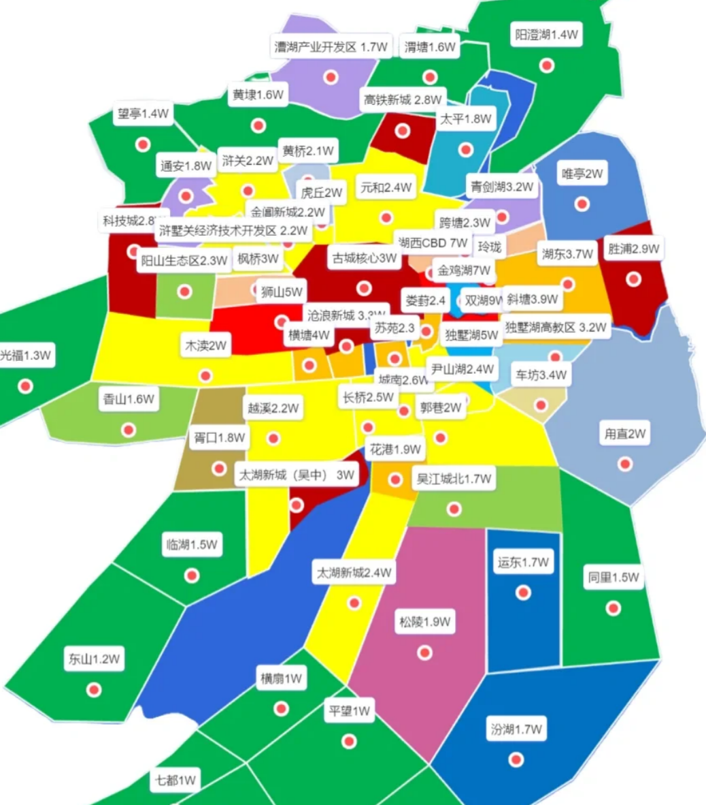

# 总论
- 我们的定位是，首次置业型的刚需客户，附带一点保值的需求
- 我们的目标是使用50-60w的首付预算，在苏州买到总价166-200w的房子
- 挑选房子的关键指标是：
  - 价格
  - 地铁（交通、通勤）
  - 宜居（面积、环境、户型、商业）
  - 学区
  - 产业和城市规划
- 二手房还是新房
  - 二手房
    - 优点
    - 缺点
  - 新房
    - 优点
    - 缺点

# 2023年苏州房市情况
- 苏州五大区简述
- 
- 苏州房价一览
- 
- 
- 重点关注的部分
  - 黄色
  - 褐色
  - 浅绿
- 不考虑的部分
  - 红色
  - 橙色
  - 深绿
- 分布特点
  - 从东边园区-姑苏区-狮山区一线，是房价的核心高峰区，约在3-5w，向西边靠近太湖的部分价格逐级下跌
  - 姑苏区南北两边是吴中区、吴江区、相城区，房价相对较低，且总体上离姑苏区越远越便宜
  - 高新区科技城、相城区高铁新城、吴中太湖新城、吴江太湖新城四大新城房价房价处于2.5-3w